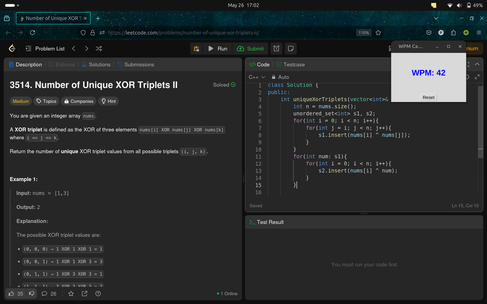

# Real-Time WPM Calculator

A lightweight, real-time typing speed monitor that tracks your Words Per Minute (WPM) across any application on your system.

## Screenshots

## Features

- 🚀 **Real-time monitoring** - Tracks typing speed as you type in any application
- 📊 **Live WPM display** - Always-on-top window shows current typing speed  
- ⚡ **Auto-reset** - Automatically resets after 5 seconds of inactivity
- 🎯 **System-wide detection** - Works across all applications and text fields
- 💻 **Lightweight** - Minimal resource usage, runs quietly in background
- 🔄 **Manual reset** - Reset button for starting fresh sessions

## Installation

**Requirements:** Linux (Ubuntu/Debian) with Python 3.6+

1. Clone this repository
2. Install dependencies: `sudo pip3 install -r requirements.txt --break-system-packages`
3. Run: `python3 wmp_calculator.py`

## Usage

1. Run the application - a small window appears showing "WPM: 0"
2. Start typing in any application 
3. Watch your real-time WPM score update
4. Counter resets after 5 seconds of no typing
5. Use Reset button for manual restart

## License

MIT License - see LICENSE file for details.
